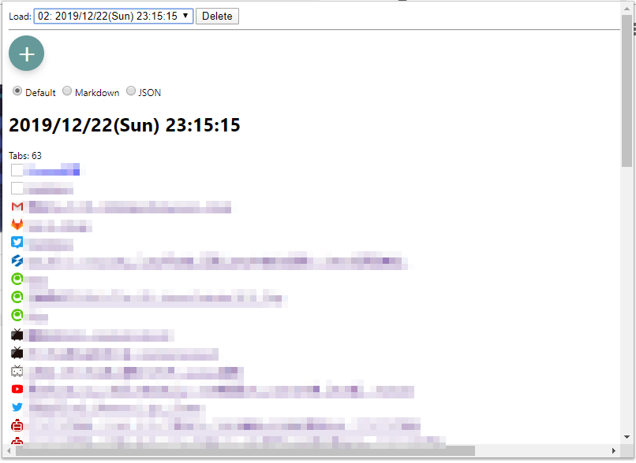
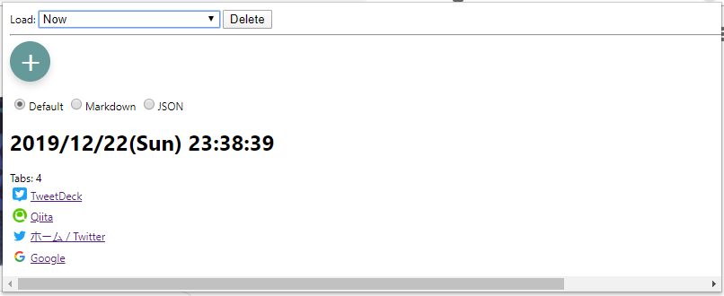
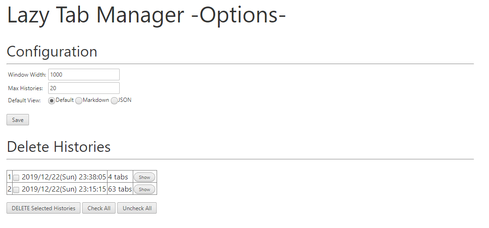

# Lazy Tab Manager

現在カレントウィンドウで開いているタブすべての情報をローカルに保存して雑に履歴管理します。  
つい大量のタブを開きがちで、後から一つ一つ確認しながら整理するのが面倒という方は使ってみてください。  
簡易的なタブのバックアップや共有にも使えると思います。

## ScreenShot

* ポップアップ画面
    
   

* Option画面
   

## Detail

https://qiita.com/S_SenSq/items/758bbde01e801e2d1624
